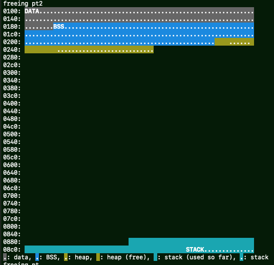

# Heap and Stack Utilization Visualizer for Arduino (Uno)

This is a simple text-based tool for visualizing the heap and stack utilization of Arduino (especially AVR5 architecture, e.g. Uno or ATmega328).

As is well known, the Arduino Uno has only 2 kilobytes of RAM, and the RAM area is shared by data, BSS, heap, and also stack sections.
In particular, the heap and stack consume the same area, from smaller address (heap) and also from larger address (stack) at the same time.
So using large amounts of heap and stack can lead to strange behavior, and the problem is hard to solve very often.

This tool consists of two software parts.
One (helper code) runs on the Arduino (written in C++) and the other on the PC (written in Python).
The Arduino helper code prints diagnostic information when some helper functions are called.
The Python code, on the other hand, decodes diagnostic information and visualizes it in color in a text terminal.

**Currently, this software is still under development.**  So it may have silly bugs.
I will continuously improve the software.
Thank you for your understanding.
Any improvements, feedback, and repo forks are welcome.

## Usage

### Arduino side

In the subdirectory `arduino_heap`, compile and upload to an Arduino Uno.
(Tested with Arduino 1.8.19.)

- `arduino_heap.ino`: a sample program
- `heapmon.cpp`: a helper code
- `heapmon.h`: a header file for the helper code

### PC side

First, you need a recent version of Python 3.
I tested the code by Python 3.9.11 on macOS.

In addition, two separate libraries are required.
Using pip, please install the following libraries.

- `pyserial`
- `termcolor`

`requirements.txt` is also available.

In the subdirectory `visualizer_python`, running `python3 visualize.py` with the argument "-h" gives the following help.

```
usage: visualize.py [-h] [-b SERIAL_SPEED] [-R] port

Heap and Stack Utilization Visualizer for Arduino (Uno)

positional arguments:
  port                  Arduino serial port (e.g. /dev/tty0)

optional arguments:
  -h, --help            show this help message and exit
  -b SERIAL_SPEED, --baud SERIAL_SPEED
                        serial port speed (aka baud rate) (default: 115200)
  -R, --force-color     Use ANSI color escape sequences even stdout is not a
                        tty (default: False)
```

By running `visualize.py`, you will see a visualization like below.



__Notice: If you're unfamiliar with keywords such as BSS, data, heap and stack sections, please find some tutorials on the Internet.__

Example: [Arduino Memory Guide | Arduino Documentation | Arduino Documentation](https://docs.arduino.cc/learn/programming/memory-guide)

Here is the legend for the color chart in Python output:

The leftmost hexadecimal numbers are the memory (RAM) starting address for the memory dump in the right part.

One character in the dump portion corresponds to one byte of memory.


- "data" is the section occupied by constant values.

- "BSS" is the section occupied by global (and possibly static) variables.

- "heap" is the section that is normally allocated dynamically by calling `malloc()` and `realloc()`.

  > As frequently discussed on the Internet forums, the Arduino "String" type allocates strings on the "heap".
  > Therefore, excessive use of `String` (often not considered excessive by programmers) leads to memory exhaustion.

    - The "heap" spaces marked with dots (`...`) are where it is currently and actually allocated.

    - Spaces without dots are in the free list, and currently not used.
      This is sometimes called "fragmentation".

- "stack" is the section stores local variables.
It is also used for nesting function calls, and also by interrupt service routines (or ISR).
The top (smallest) address of the stack is called the "stack pointer (or SP)".

  > Strictly speaking, the AVR architecture defines SP to be one byte less than the top of the stack.

    - The stack spaces marked with dots are where it is currently (and actually) occupied by local variables and nesting function calls.
      The printed information is as of the time you called `heapmon_print_stats()` (explained later).

    - Spaces without dots are not currently used (contains junk data).
      However, the space may have "chance" once conflicted with the "heap" section, so far.
      Programmers should be aware of the **maximum** stack usage.

## Limitations

- Some information about the hardware (or processor architecture) is hard-coded in the C++ and Python code.

- Stack usage (or maximum utilization so far) is just an **estimate**.
  Determining the actual maximum stack usage is difficult.
  (And the estimation code may need to be improved in the future.)

## Explanation of Arduino side function calls

- `heapmon_fill_stack()`: Calling this function is optional, but required to estimate maximum stack usage.
  This function should be called as soon as possible in `setup()`.

- `heapmon_print_consts()`: This call is mandatory.
  Should be called once `Serial.begin()` done.

- `heapmon_print_stats()`: This is essential function to print heap and stack usage.
  Whenever you think (or suspect) heap or stack utilization is affected, you can call this anytime.
  Especially, to record the maximum stack usage, it should be called in the deepest nesting functions as following.

```C++
void A() {
    B();
}

void B() {
    C();
}

void C() {  // This is the deepest nesting function call (A() -> B() -> C()).
    // some code
    heapmon_print_stats();
}
```

## Blogs

- [Written in Japanese, but there is a translation button on the top right.](https://flogics.com/wp/ja/2023/03/visualize_heap_and_stack_usage_of_arduino_uno/)

(c) Copyright 2023, Atsushi Yokoyama, Firmlogics
